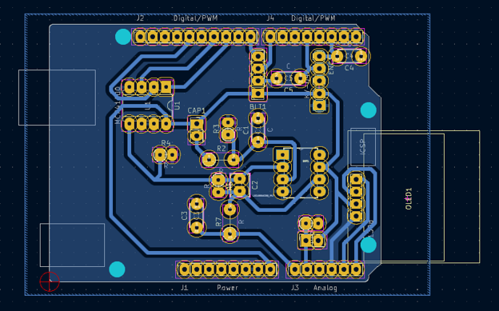

# Shield KiCad

Modèle du PCB par lequel les différents éléments du projet sont reliés, réalisé sur **KiCad** :

  

Principales caractéristiques :
 - Tous les circuits sur une seule face
 - Tous les composants directement intégrés au PCB
 - Pins non reliés : au GND
