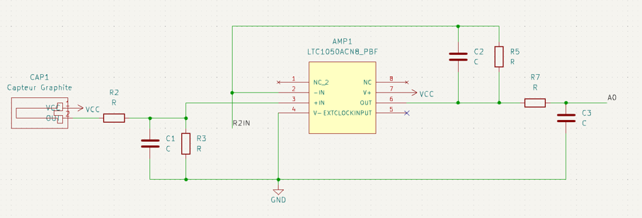

# 2023-2024-4GP-Brasseur-Guyot
Projet capteur low-tech en graphite par Damien Brasseur et Tristan Guyot

## 1 - Description générale du projet

### Principe

Les capteurs sont partout. Dès qu’on cherche à automatiser un système, quel qu’il soit, on a besoin de capteurs. Pourtant, la plupart sont très coûteux en énergie, et leur multiplication fait qu’ils sont de plus en plus impactants sur l’environnement. C’est pour ça que les capteurs low-tech représentent un atout non négligeable. 

Un dépôt de graphite sur du papier forme un système granulaire, composé de grains de plus ou moins grande taille espacés d'une certaine distance, appelée distance inter-grain.
Cette propriété fait que sa conductance dépend de façon exponentielle de la distance inter-grain, qui peut être modulée en repliant le papier.
Ainsi, on peut retrouver la contrainte appliquée au matériau directement en mesurant la résistance aux bornes du capteur.

### Contenu du banc

 - Le capteur graphite (interchangeable)
 - Un amplificateur permettant de mesurer avec précision les variations (cette amplification peut être modulée via la modification de la résistance R2 de la boucle de rétroaction de l'amplificateur, pilotée grâce à l'encodeur rotatoire)
 - Un capteur flex-sensor permettant de comparer les mesures du capteur graphite
 - Un écran OLED, sur lequel les mesures sont affichées en temps-réel
 - Une application Android, connectée en Bluetooth, sur laquelle les mesures et leur variation peuvent être visionnée

  

## 2 - Caractéristiques techniques

La *datasheet* est accessible à l'adresse suivante : https://google.com

### Capteur

  

### Electronique

  

### KiCad

Explications disponibles [ici](https://github.com/MOSH-Insa-Toulouse/2023-2024-4GP-Brasseur-Guyot/tree/main/KiCad)

### Code Arduino

Explications disponibles [ici](https://github.com/MOSH-Insa-Toulouse/2023-2024-4GP-Brasseur-Guyot/tree/main/Code%20Arduino)

### Application Android

Explications disponibles [ici](https://github.com/MOSH-Insa-Toulouse/2023-2024-4GP-Brasseur-Guyot/tree/main/Application%20Android)

## 3 - Mode d'emploi

### KiCad

Le dossier KiCad est à télécharger dans son intégralité.
Une fois téléchargé, il faudra recharger les librairies de symboles depuis le dossier Mods.

### Code Arduino

Pour charger le code sur la carte **Arduino UNO**, rien de plus facile ! Il suffit de l'ouvrir dans l'application Arduino IDE avec la carte branchée en USB, puis cliquer sur *Upload*.

### Application Android

L'application est à télécharger sur un téléphone Android. Après l'installation, aller dans les paramètres des applications Android et accorder l'accès au Bluetooth et au micro à l'application.
Pour assurer la connexion entre la carte Arduino et le téléphone, il faut d'abord se connecter au module Bluetooth de la carte avec l'interface générale Bluetooth du téléphone. Ensuite, on pourra sélectionner dans l'application le module et on pourra commencer à s'amuser.

## 4 - Tests du capteur graphite

Nous avons réalisé des mesures de compression et de détente avec des capteurs comportant différentes densités de graphite (variant avec le type de crayon : 4H, HB et 4B), ainsi que pour le Flex sensor.

Le banc de test sur lequel nous avons testé les mesures comporte 4 demi-cercles de diamètres 2cm, 3cm, 4cm et 5cm, respectivement.

Voici la caractéristique en détente : 

  

On remarque que la variation de résistance la plus marquée (pente la plus élevée) est cele du capteur au crayon 4H. De façon surprenante, le capteur au cayon HB est moins efficace que le capteur 4B.

Voici la caractéristique en compression : 

  

Même comportement, sauf qu'une limite a été atteinte en mesure de compression (demi-cercle de 2cm) avec le capteur 4H. Le flex sensor ne fonctionnant que dans un seul sens, nous n'avons pas pu le tester dans ces conditions.
